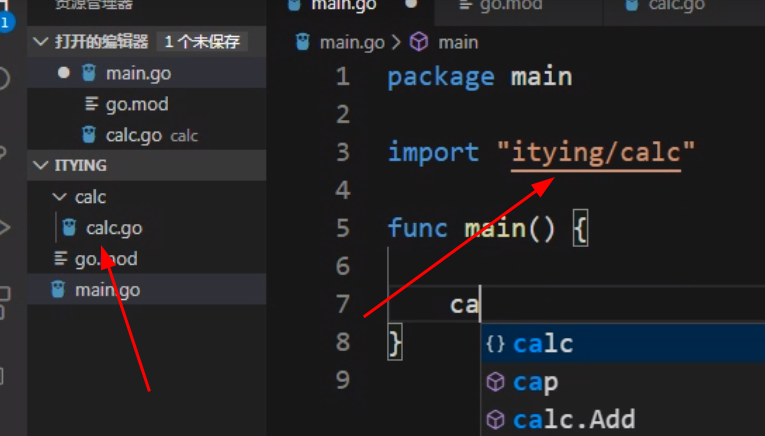
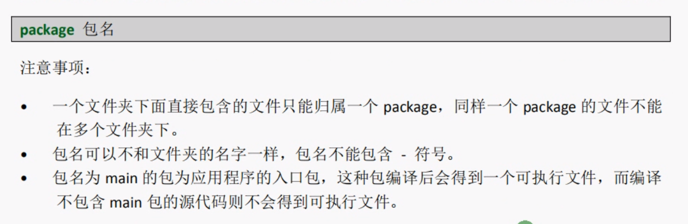
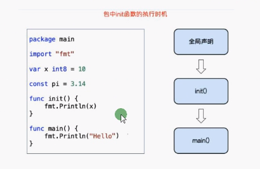
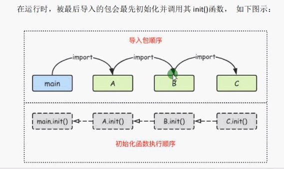

# Go Mod(包管理工具)

### 1. go mod init 初始化项目

### 2.大写导出，小写私有


### 3.Note：



### 导入初始化顺序





### 第三方包的使用

1. 下载安装包

   ``` go 
    
   go get github.com/shopspring/decimal （全局）
   //第二种
   go mod download （全局）
   ```

   

2. go mod vendor 将依赖复制到vendor目录下