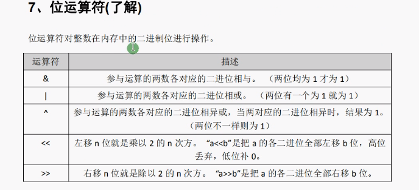
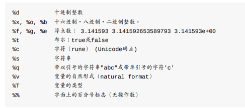
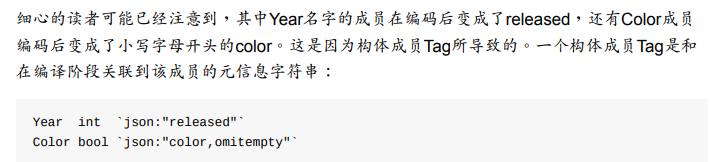

# Tips





```go
var palette = []color.Color{color.White, color.Black}
anim := gif.GIF{LoopCount: nframes}
```


[]color.Color{...}和gif.GIF{...}这两个表达式就是我们说的复合声明（4.2和4.4.1节有说明）。这 是实例化Go语言里的复合类型的一种写法。






编码的逆操作是解码，对应将JSON数据解码为Go语言的数据结构，Go语言中一般叫 unmarshaling，通过json.Unmarshal函数完成。下面的代码将JSON格式的电影数据解码为一 个结构体slice，结构体中只有Title成员。通过定义合适的Go语言数据结构，我们可以选择性 地解码JSON中感兴趣的成员。当Unmarshal函数调用返回，slice将被只含有Title信息值填 充，其它JSON成员将被忽略。

```go
var titles []struct{ Title string }
if err := json.Unmarshal(data, &titles); err != nil {
log.Fatalf("JSON unmarshaling failed: %s", err)
}
fmt.Println(titles) // "[{Casablanca} {Cool Hand Luke} {Bullitt}]"
```

