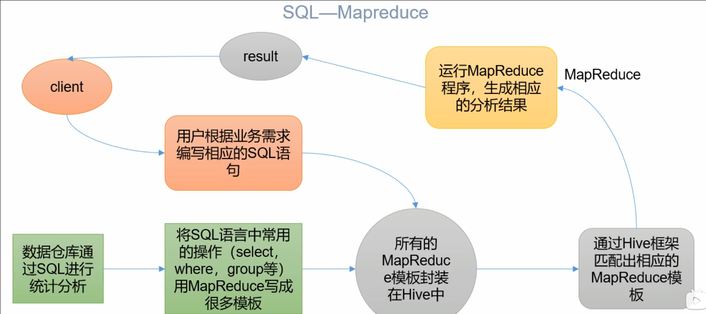
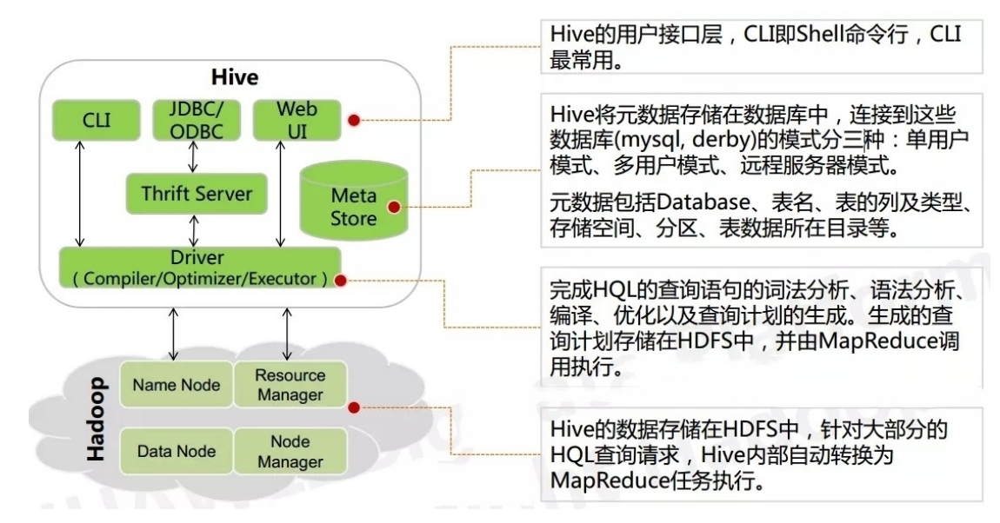

# Hive基本概念

## 什么是Hive

1. 简介

   Hive是由Facebook开源用于解决海量结构化日志的数据统计工具。

   Hive是基于Hadoop的一个数据仓库工具，可以将结构化的数据文件映射为一张表，并提供类SQL查询功能。

2. 本质：将SQL转化成MapReduce程序

   

   - Hive 处理的数据存储在HDFS
   - Hive分析数据底层的实现是MapReduce
   - 执行程序运行在YARN上

## Hive的优缺点

1. 优点

   - 操作接口采用类SQL语法，提供快速开发能力（简单、容易上手）
   - 避免了去写MapReduce，减少了开发人员的学习成本。
   - Hive的执行延迟比较高，因此Hive常用于数据分析，对实时性要求不高的场合
   - Hive优势在于处理大数据，对于处理小数据没有优势，因为Hive的执行延时比较高。
   - Hive支持用户自定义函数，用户可以根据自己的需求来实现自己的函数

2. 缺点

   Hive的HQL表达能力有限

   - 迭代式算法无法表达
   - 数据挖掘方面不擅长，由于MapReduce数据处理流程的限制，效率更高的算法却无法实现。

   Hive的效率比较低

   - Hive自动生成的MapReduce作业，通常情况下不够智能化
   - Hive调优比较困难，颗粒度不够细

## Hive架构原理

## Hive和数据库比较

​	Hive和数据库除了拥有类似的查询语言，再无其他类似之处。

1. 查询语言：相似

2. 数据更新

   由于Hive是针对数据仓库应用设计的，而数据仓库的内容是多读少写的。因此，Hive中不建议对数据进行改写，所有的数据都是在加载的时候确定好的。

   而数据库中的数据通常是需要经常进行修改的。

3. 执行延迟

   Hive查询数据的时候，由于没有索引，需要扫描整个表，故延时较高。另一个因素是MapReduce框架。

   数据库则是在数据规模小的时候延时低，当数据规模大到超过数据库的处理能力的时候，Hive的并行计算就能体现出来优势。

4. 数据规模

   Hive：数据规模较大

   数据库：数据规模较小 

