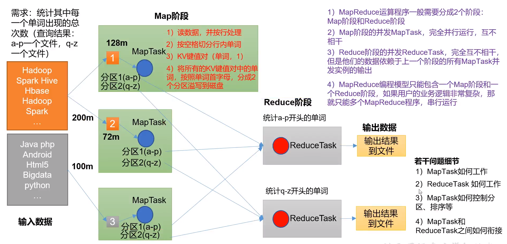

# MapReduce

总体学习路径


## 概述

1. 定义

   - MapReduce 是一个**分布式运算程序的编程框架**，是用户开发“基于 Hadoop 的数据分析 应用”的核心框架。 MapReduce 核心功能是**将用户编写的业务逻辑代码和自带默认组件整合成一个完整的 分布式运算程序**，并发运行在一个 Hadoop 集群上。

2. 优缺点

   - 优点：
     - 易于编程（它简单的实现一些接口，就可以完成一个分布式程序）
     - 良好的扩展性（增加机器扩展计算能力）
     - 高容错性（一台机器挂了，可以转移到另一台机器上计算）
     - 适合 PB 级以上海量数据的离线处理 可以实现上千台服务器集群并发工作
   - 缺点：
     - 不擅长实时计算
     - 不擅长流式计算（流式计算的输入数据是动态的，而 MapReduce 的输入数据集是静态的，不能动态变化）
     - 不擅长DAG（有向无环图）计算多个应用程序存在依赖关系，后一个应用程序的输入为前一个的输出。在这种情况下，MapReduce **并不是不能做**，而是使用后，**每个 MapReduce 作业的输出结果都会写入到磁盘，会造成大量的磁盘 IO，导致性能非常的低下。**

3. 核心思想

   

   （1）分布式的运算程序往往需要分成至少 2 个阶段。 

   （2）第一个阶段的 MapTask 并发实例，完全并行运行，互不相干。 

   （3）第二个阶段的 ReduceTask 并发实例互不相干，但是他们的数据依赖于上一个阶段 的所有 MapTask 并发实例的输出。 

   （4）MapReduce 编程模型只能包含一个 Map 阶段和一个 Reduce 阶段，如果用户的业 务逻辑非常复杂，那就只能多个 MapReduce 程序，串行运行。 总结：分析 WordCount 数据流走向深入理解 MapReduce 核心思想。

4. MapReduce进程

   一个完整的MapReduce程序在分布式运行时有三类实例进程：

   1. MrAppMaster：负责整个程序的**过程调度**及**状态协调**
   2. MapTask：负责Map阶段整个数据处理流程
   3. ReduceTask：负责Reduce阶段的整个数据处理流程

5. WordCount源码

   ```java 
   package org.apache.hadoop.examples;
   
   import java.io.IOException;
   import java.util.StringTokenizer;
   
   import org.apache.hadoop.conf.Configuration;
   import org.apache.hadoop.fs.Path;
   import org.apache.hadoop.io.IntWritable;
   import org.apache.hadoop.io.Text;
   import org.apache.hadoop.mapreduce.Job;
   import org.apache.hadoop.mapreduce.Mapper;
   import org.apache.hadoop.mapreduce.Reducer;
   import org.apache.hadoop.mapreduce.lib.input.FileInputFormat;
   import org.apache.hadoop.mapreduce.lib.output.FileOutputFormat;
   import org.apache.hadoop.util.GenericOptionsParser;
   
   public class WordCount {
       
     //<Object, Text, Text, IntWritable>
     //对应输入K，V类型和输出K，v类型
     //定义一个类（此处为静态内部类）继承自Mapper
     public static class TokenizerMapper 
          extends Mapper<Object, Text, Text, IntWritable>{
       
       private final static IntWritable one = new IntWritable(1);
       private Text word = new Text();
       
       //重写Map方法
       //@Override
       public void map(Object key, Text value, Context context
                       ) throws IOException, InterruptedException {
         StringTokenizer itr = new StringTokenizer(value.toString());
         while (itr.hasMoreTokens()) {
           word.set(itr.nextToken());
           context.write(word, one);
         }
       }
     }
     //定义一个类（此处为静态内部类）继承自Reducer
     public static class IntSumReducer 
          extends Reducer<Text,IntWritable,Text,IntWritable> {
       private IntWritable result = new IntWritable();
         
       //重写reduce 方法
       //@Override
       public void reduce(Text key, Iterable<IntWritable> values, 
                          Context context
                          ) throws IOException, InterruptedException {
         int sum = 0;
         for (IntWritable val : values) {
           sum += val.get();
         }
         result.set(sum);
         context.write(key, result);
       }
     }
   
     public static void main(String[] args) throws Exception {
       Configuration conf = new Configuration();
       String[] otherArgs = new GenericOptionsParser(conf, args).getRemainingArgs();
       if (otherArgs.length < 2) {
         System.err.println("Usage: wordcount <in> [<in>...] <out>");
         System.exit(2);
       }
       Job job = Job.getInstance(conf, "word count");
       job.setJarByClass(WordCount.class);
       job.setMapperClass(TokenizerMapper.class);
       job.setCombinerClass(IntSumReducer.class);
       job.setReducerClass(IntSumReducer.class);
       job.setOutputKeyClass(Text.class);
       job.setOutputValueClass(IntWritable.class);
       for (int i = 0; i < otherArgs.length - 1; ++i) {
         FileInputFormat.addInputPath(job, new Path(otherArgs[i]));
       }
       FileOutputFormat.setOutputPath(job,
         new Path(otherArgs[otherArgs.length - 1]));
       System.exit(job.waitForCompletion(true) ? 0 : 1);
     }
   }
   ```

6. 常用数据序列化类型

   | Java类型 | Hadoop Writable类型 |
   | -------- | ------------------- |
   | Boolean  | Booleanwritable     |
   | Byte     | ByteWritable        |
   | Int      | IntWritable         |
   | Float    | FloatWritable       |
   | Long     | LongWritable        |
   | Double   | DoubleWritable      |
   | String   | Text                |
   | Map      | MapWritable         |
   | Array    | ArrayWritable       |
   | Null     | NullWritable        |

7. MapReduce编程规范

   用户编写的程序分成三个部分：Mapper、Reducer 和 Driver。

   1. Mapper阶段
      - 用户自定义的Mapper要继承Mapper父类
      - Mapper的输入数据是KV对类型（KV为泛型，可自定义）
      - Mapper中的业务逻辑写在map()方法中
      - Mapper的输出数据是KV对的形式（KV为泛型，可自定义）
      - map()方法（MapTask进程）对每一个<K,V>调用一次
   2. Reduce阶段
      - 用户自定义的Reduce要继承Reduce父类
      - Reducer的输入数据类型对应Mapper输出数据类型，也是KV
      - Reduce的业务逻辑写在Reduce()方法中
      - Reduce()方法（ReduceTask进程）对每一组相同K的<K,V>组调用一次reduce()方法
