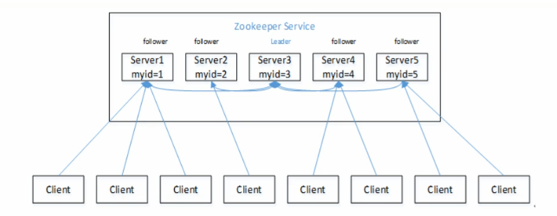
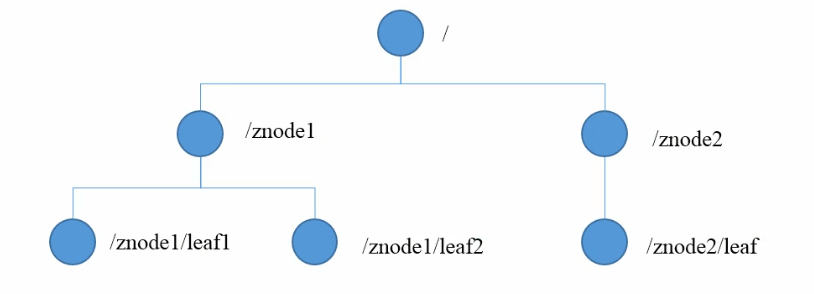

# ZooKeeper 入门

Zookeeper是一个开源、分布式的为分布式应用提供协调服务的Apache项目。

## 工作机制

​	Zookeeper从设计模式角度来理解：是一个基于观察者模式设计的分布式服务管理管理框架，它负责存储和管理大家都关心的数据，然后接受观察者的注册，一旦这些数据的状态发生变化，Zookeeper就将负责通知已经在Zookeeper上注册观察者作出相应的反应。


## 特点



1. Zookeeper：一个Leader，多个Follower组成的集群。
2. 集群中只要有半数以上的节点存活，Zookeeper集群就能正常服务。
3. 全局数据一致：每个Server保存一份相同的数据副本，Client无论连接到那个Server，数据都是一致的。
4. 更新请求顺序执行，来自同一个Client的更新请求按其发送顺序依次执行。
5. 数据更新原子性，一次数据更新要么成功，要么失败。
6. 实时性，在一定时间范围内，Client能读到最新数据。

## 数据结构

Zookeeper数据模型的结构与Unix文件系统很类似，整体上可以看做是一棵树，每个节点称做一个ZNode。每一个ZNode默认能够存储1MB的数据，每个ZNode都可以通过其路径 唯一标识。



## 应用场景

提供的服务：

- 统一命名服务：在分布式环境下，经常需要对应用/服务进行统一命名，便于识别。

- 统一配置管理：在分布式环境下，配置文件同步非常常见。

  - 一般要求一个集群中，所有节点的配置信息是一致的。
  - 对配置文件修改后，希望能快速同步到各个节点上。
  - 可将配置信息写入Zookeeper上的一个Znode。
  - 各个客户端服务器监听这个ZNode。
  - 一旦ZNode中的数据修改，Zookeeper将通知各个客户端服务器。

- 统一集群管理

  - 分布式环境下，实时掌握每个节点的状态是必要的
    - 可以根据节点实时状态做出一些调整
  - Zookeeper可以实现实时监控节点状态变化
    - 可将节点信息写入Zookeeper上的一个ZNode。
    - 监听这个ZNode可获取它的实时状态变化。

- 服务器动态上下线

  ​	客户端能实时洞察到服务器上下线的变化。

- 软负载均衡

  ​	在Zookeeper中记录每台服务器的访问数，让访问数最少的服务器取处理最新的客户端请求。

## 安装

[下载地址](https://zookeeper.apache.org)

### 1. 先前准备

- JDK

- Zookeeper压缩包

- 解压到指定目录

  ```bash
  tar -xzvf [name] -C [PATH]
  ```

### 2. 配置修改

- 将`./conf`路径下的`zoo_sample.cfg`修改为`zoo.cfg`；

- 打开zoo.cfg文件，修改dataDir路径

  ```bash
  dataDir=[PATH]
  ```

- 在Zookeeper根目录创建zkData文件夹

### 3.操作Zookeeper

- 启动Zookeeper
- ./bin/zkServer.sh start
- 查看状态 ./bin/zkServer.sh status
- 启动客户端 ./bin/zkCli.sh
- 退出客户端 quit
- 停止Zookeeper ./bin/zkServer.sh stop

### 4.配置参数解读

- clientPort：这个端口就是客户端连接 Zookeeper 服务器的端口，Zookeeper 会监听这个端口，接受客户端的访问请求。

- dataDir：Zookeeper 保存数据的目录。

- dataLogDir：Zookeeper 保存日志的目录。

- tickTime：这个时间是作为 Zookeeper 服务器之间或客户端与服务器之间维持心跳的时间间隔，也就是每隔 tickTime 时间就会发送一个心跳。
