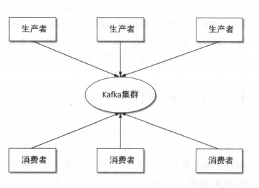
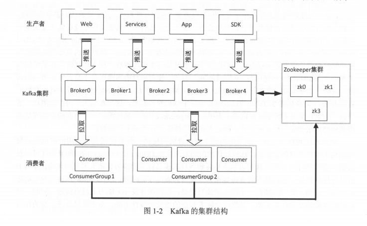

# Kafka

Kafka 是一个高吞吐量、分布式的**发布一订阅**消息系统

 Kafka 己经定位为 个**分布式流式处理平台（ distributed earning platform ）**

它最初由 Linkedin 公司开发，后来成为 Apache 项目的一部分。 Kafka 核心模块**使用 Scala 语言开发**，支持**多语言 （如 Java IC＋＋ rthon Go Erlang Node.js 等）客户端**。

它以可水平扩展和具有高吞吐量等 特性而被广泛使用 目前越来越多的**开源分布式处理系统（如 Flume Apache Storm Spark Flink 等）支持与 Kafka 集成**。

随着信息技术的快速发展及互联网用户规模的急剧增长，计算机所存储的信息量正呈爆炸 式增长，目前数据量己进入**大规模和超大规模的海量数据时代**，如何高效地**存储、分析、处理 和挖掘**海量数据己成为技术研究领域的热点和难点问题。

**Kafka 是一款开源的、轻量级的 、分布式、可分区和具有复制备份的 Replicated ）、基于 Zoo Keeper 协调管理的分布式流平台的功能强大的消息系统 。**

## Kafka 基本结构

作为 个消息系统，其基本结构中 至少要有**产生消息的组件（消息生产者 Producer ）**以及**消费消息的组件 （消费者**， onsumer ）虽然消费者并不是必需的 ，但离开了消费者构建一个消 息系统终究是毫无意义的。 

有几个问题需要考虑：

- 生产者如何将生产 的消息写入 Kafka 
- 消 费者如何从 Kafka 集群消费消息
-  Kafka 何存储消息
-  Kafka 集群如何管理调度
- 如何进行消息负载均衡
- 以及各组件间如何进行通信

## Kafka 基本概念

- 主题
  - Kafka 组消息抽象归纳为 个主题（ Topic ），也就是说，一个主题就是对消息的 分类。生产者将消息发送到特定主题，消费者订阅主题或主题的某些分区进行消费。
- 消息
  - 消息是 Kafka 通信的基本单位，由 个固定长度的消息头和 个可变长度的消息体构成 在老版本中，每 条消息称为 Message ：在由 Java 重新实现的客户端中，每 条消息称为 Record
- 分区和副本
  - Kafka 组消息归纳为 个主题，而每个主题又被分成 个或多个分区（ Partition 个分区由 系列有序、不可变的消息组成，是一个有序队列。
  - 每个分区在物理上对应为 个文件夹，分区的命名规则为主题名称后接“一”连接符，之 后再接分区编号，分区编号从 开始，编号最大值为分区的总数减 每个分区又有 **一至多个** 副本（ Replica ），分区的副本分布在集群的不同代理上，以提高可用性
- Leader 副本和 Follower 副本
  - 由于 Kafka 副本的存在，就需要保证 个分区的多个副本之间数据的一致性， Kafka 会选 择该分区的一个副本作为 Leader 副本，而该分区其他副本即为 Follower 副本，只有 Leader 本才负责处理客户端读／写请求， Follower 副本从 Leader 副本同步数据 。
- 偏移量
  - 任何发布到分区的消息会被直接追加到日志文件（分区目录下以＂ .log ”为文件名后缀的 数据文件〉的尾部，而每条消息在日志文件中的位置都会对应一个按序递增的偏移量 。
  - 偏移量 是一个分区下严格有序的逻辑值，它并不表示消息在磁盘上的物理位置
- 日志段
  - 一个日志又被划分为多个日志段（ LogSegment ），日志段是 Kafka 日志对象分片的最小单 。与 日志对象 样，日志段也是 个逻辑概念， 
- 代理
  - Kafka 基本体系结构中我 提到了 Kafka 集群 Kafka 集群就是由一个或多个 Kafka 例构成，我们将每一个 Kafka 实例称为代理（ Broker ），通常也称代理为 Kafka 服务器 ( KafkaServer 。
  - 在生产环境中 Kafka 集群 般包括一台或多台服务器，我们可以在一台服务器 上配置 个或多个代理。每 个代理都有唯 的标识 id ，这个 id 个非负整数。在一 Kafka 集群中，每增加 个代理就需要为这个代理配置 个与该集群中其他代理不同的 id, id 值可以 选择任意非负整数即可，只要保证它在整个 Kafka 集群中唯 ，这个 id 就是代理的名字，也就 是在启动代理时配置的 broker.id 对应的值，因此在本书中有时我们也称为 brokerId 由于给每 个代理分配了不同的 brokerId ，这样对代理进行迁移就变得更方便，从而对消费者来说是透明 不会影响消费者对消息的消费。
- 生产者
- 消费者和消费组
  - 消费者（ omsumer ）以拉取（ pull ）方式拉取数据，它是消费的客户端。在 Kafka 每一 个消费者都属于 个特定消费组（ ConsumerGroup ），我们可以为每个消费者指定 个消费组， groupld 表消费组名称，通过 group.id 置设置 如果不指定消费组，则该消费者属于默 认消费组 test-consumer-group 同时，每个消费者也有 个全局唯 通过配置项 client.i 指定，如果客户端没有指定消费者的 id, Kafka 会自动为该消费者生成 个全局唯 id ，格 式为$ {groupld }-$ {hostN ame }-$ {times tamp}-$ {UUID 字符｝。
  - 同一个主题的一条消息只能被同一个消费组下某一个消费者消费，但不同消费组的消费者可同时消费该消息 消费组是 Kafka 用来实现对 题消息进行广播和单播的手段，实现消息广播只需指定各消费者均属于不同 的消费组，消息单播则只 让各消费者属于同一个消费组
- ISR 
  - Kafka ZooKeeper 中动态维护了 IS (In-sync Replica ），即保存同步的副本列表， 列表中保存的是与 Leader 副本保持消息同步的所有副本对应的代理节点 id 如果 Follower 副本岩机（本书用岩机来特指某个代理失效的情景，包括但不限于代理被关闭，如代理被人为 关闭或是发生物理故障、心跳检测过期、网络延迟、进程崩溃等）或是落后太多，则该 Follower 副本节点将从 ISR 列表中移除
-  ZooKeeper 
  - Kafka 利用 ZooKeeper 保存相应元数据信息， Kafka 元数据信息包括如代理节点信息、 Kafka 群信息、旧版消费者信息及其消费偏移量信息、主题信息、分区状态信息、分区副本分配方 案信息、动态配置信息等。 Kafka 在启动或运行过程当中会在 ZooKeeper 上创建相应节点来保 存元数据信息， Kafka 通过监昕机制在这些节点注册相应监听器来监昕节点元数据的变化，从 而由 ZooKeeper 负责管理维护 Kafka 集群，同时通过 ZooKeeper 我们能够很方便地对 Kafka 群进行水平扩展及数据迁移

