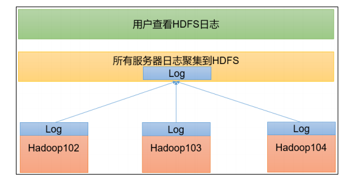

# Hadoop的安装

## 3.X版本的安装

1. 先前准备
   - JDK
   - 压缩包
   - LINUX系统
   
2. 解压Hadoop到你所要安装的目录

   1. ```she
      tar -xzvf {Hadoop}.tar.gz -C /{目录}

3. 


## 集群配置


### 集群部署规划

- NameNode 和 SecondaryNameNode 不要安装在同一台服务器

- ResourceManager 也很消耗内存，不要和 NameNode、SecondaryNameNode 配置在 同一台机器上。

|      | master                           | slave1       | slave2                       | slave3                   |
| ---- | -------------------------------- | ------------ | ---------------------------- | ------------------------ |
| IP   | 172.21.3.210                     | 172.21.3.213 | 172.21.3.212                 | 172.21.3.211             |
| Mem  | 16G                              | 4G           | 8G                           | 4G                       |
| HDFS | **NameNode**、DataNode           | DataNode     | DataNode、**SecondNameNode** | DataNode、**JobHistory** |
| YARN | **ResourceManager**、NodeManager | NodeManager  | NodeManager                  | NodeManager              |

### 配置文件说明

Hadoop 配置文件分两类：默认配置文件和自定义配置文件，**只有用户想修改某一默认 配置值时，才需要修改自定义配置文件，更改相应属性值。**

1. 默认配置文件

   ​	

   | 要获取的默认配置文件 | 文件存放在Hadoop的jar包中的位置                       |
   | -------------------- | ----------------------------------------------------- |
   | core-default.xml     | hadoop-common-*.jar/core-default.xml                  |
   | hdfs-default.xml     | hadoop-hdfs-*.jar/hdfs-default.xml                    |
   | yarn-default.xml     | hadoop-yarn-common-*.jar/yarn-default.xml             |
   | mapred-default.xml   | hadoop-maprudece-client-core-*.jar/mapred-default.xml |

2. 自定义配置文件

   core-site.xml、hdfs-site.xml、yarn-site.xml、mapred-site.xml 四个配置文件存放在 $HADOOP_HOME/etc/hadoop 这个路径上，**用户可以根据项目需求重新进行修改配置。**

### 配置集群

1. 配置文件

   - core-site.xml

     ```xml
     <?xml version="1.0" encoding="UTF-8"?>
     <?xml-stylesheet type="text/xsl" href="configuration.xsl"?>
     <configuration>
      <!-- 指定 NameNode 的地址 -->
      <property>
      <name>fs.defaultFS</name>
      <value>hdfs://hadoop102:8020</value>
      </property>
      <!-- 指定 hadoop 数据的存储目录 -->
      <property>
      <name>hadoop.tmp.dir</name>
      <value>/opt/module/hadoop-3.1.3/data</value>
      </property>
      <!-- 配置 HDFS 网页登录使用的静态用户为 atguigu -->
      <property>
      <name>hadoop.http.staticuser.user</name>
      <value>atguigu</value>
      </property>
     </configuration>
     ```

     

   - hdfs-site.xml

     ```xml
     <?xml version="1.0" encoding="UTF-8"?>
     <?xml-stylesheet type="text/xsl" href="configuration.xsl"?>
     <configuration>
     <!-- nn web 端访问地址-->
     <property>
      <name>dfs.namenode.http-address</name>
      <value>hadoop102:9870</value>
      </property>
     <!-- 2nn web 端访问地址-->
      <property>
      <name>dfs.namenode.secondary.http-address</name>
      <value>hadoop104:9868</value>
      </property>
             <property>
             <name>dfs.name.dir</name>
             <value>/home/hadoop/hdfs/name</value>
         </property>
         <property>
             <name>dfs.data.dir</name>
             <value>/home/hadoop/hdfs/data</value>
         </property>
     
     </configuration>
     ```

     

   - yarn-site.xml

     ```xml
     <?xml version="1.0" encoding="UTF-8"?>
     <?xml-stylesheet type="text/xsl" href="configuration.xsl"?>
     
     <configuration>
      <!-- 指定 MR 走 shuffle -->
      <property>
      <name>yarn.nodemanager.aux-services</name>
      <value>mapreduce_shuffle</value>
      </property>
      <!-- 指定 ResourceManager 的地址-->
      <property>
      <name>yarn.resourcemanager.hostname</name>
      <value>hadoop103</value>
      </property>
      <!-- 环境变量的继承 -->
      <property>
      <name>yarn.nodemanager.env-whitelist</name>
     
     <value>JAVA_HOME,HADOOP_COMMON_HOME,HADOOP_HDFS_HOME,HADOOP_CO
     NF_DIR,CLASSPATH_PREPEND_DISTCACHE,HADOOP_YARN_HOME,HADOOP_MAP
     RED_HOME</value>
      </property>
     </configuration>
     ```

     

   - mapred-site.xml

     ```xml
     <?xml version="1.0" encoding="UTF-8"?>
     <?xml-stylesheet type="text/xsl" href="configuration.xsl"?>
     <configuration>
     <!-- 指定 MapReduce 程序运行在 Yarn 上 -->
      <property>
      <name>mapreduce.framework.name</name>
      <value>yarn</value>
      </property>
     </configuration>
     ```

   - works

     ```
     master
     slave1
     slave2
     slave3
     ```

2. 启动集群

   

3. 异常处理

### 配置历史服务器

为了查看程序的历史运行情况，需要配置一下历史服务器。具体配置步骤如下：

1. 配置 mapred-site.xml

   ```xml
   <!-- 历史服务器端地址 -->
   <property>
    <name>mapreduce.jobhistory.address</name>
    <value>hadoop102:10020</value>
   </property>
   <!-- 历史服务器 web 端地址 -->
   <property>
    <name>mapreduce.jobhistory.webapp.address</name>
    <value>hadoop102:19888</value>
   </property>
   ```

2. 启动/停止JobHistory

   ```shell
   mapred --daemon start historyserver
   mapred --daemon stop historyserver
   ```

### 配置日志的聚集

日志聚集概念：应用运行完成以后，将程序运行日志信息上传到 HDFS 系统上。



日志聚集功能好处：可以方便的查看到程序运行详情，方便开发调试。 

注意：开启日志聚集功能，需要重新启动 NodeManager 、ResourceManager 和 HistoryServer。

1. 配置yarn-site.xml

   ```xml
   <!-- 开启日志聚集功能 -->
   <property>
    <name>yarn.log-aggregation-enable</name>
    <value>true</value>
   </property>
   <!-- 设置日志聚集服务器地址 -->
   <property>
    <name>yarn.log.server.url</name>
    <value>http://hadoop102:19888/jobhistory/logs</value>
   </property>
   <!-- 设置日志保留时间为 7 天 -->
   <property>
    <name>yarn.log-aggregation.retain-seconds</name>
    <value>604800</value>
   </property>
   ```

2. 重启集群

### 测试wordcount程序

```shell
hadoop jar /opt/module/hadoop-3.3.1/share/hadoop/mapreduce/hadoop-mapreduce-examples-3.3.1.jar wordcount / /output
```

- 错误: 找不到或无法加载主类 org.apache.hadoop.mapreduce.v2.app.MRAppMaster
  - shell 下执行 hadoop classpath
  - 在mapred-site.xml 里添加配置文件
  - [详情](https://stackoverflow.com/questions/50927577/could-not-find-or-load-main-class-org-apache-hadoop-mapreduce-v2-app-mrappmaster)
  - 

