# Basic

### 关键字与保留字

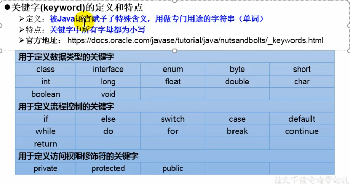

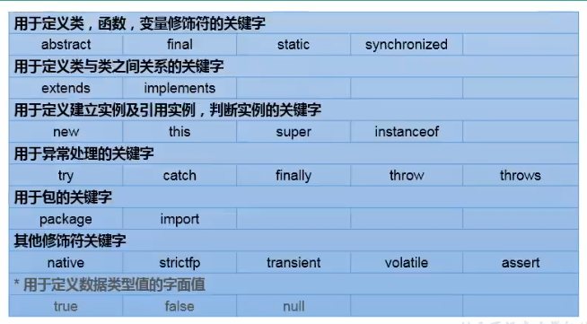

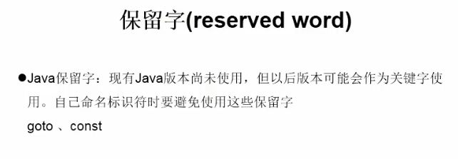

### 标识符（Identifier）

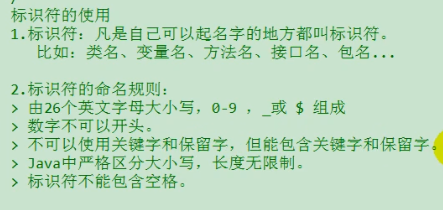

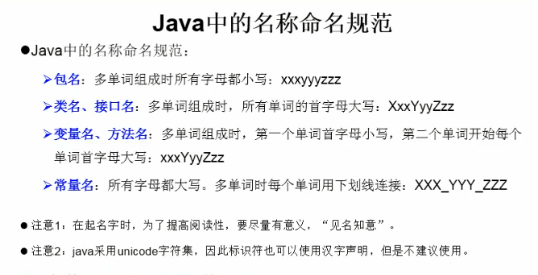

### 变量（various）

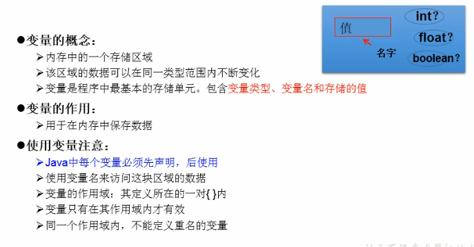

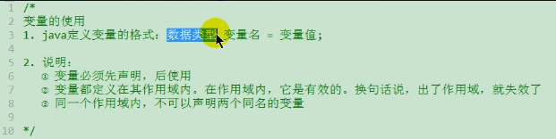

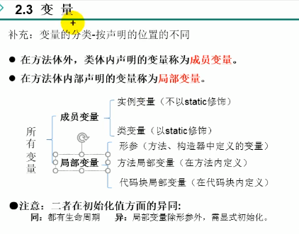

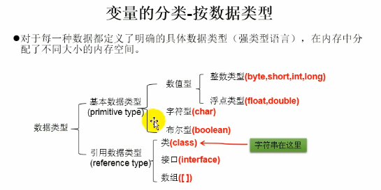

1. 基本数据类型

   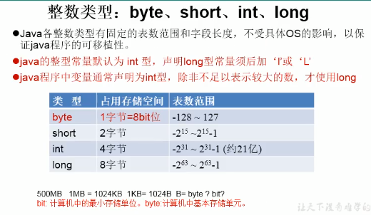

   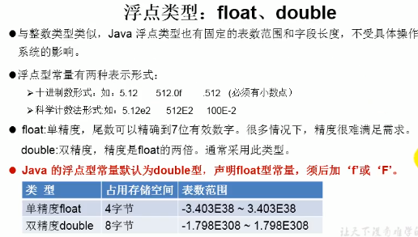

   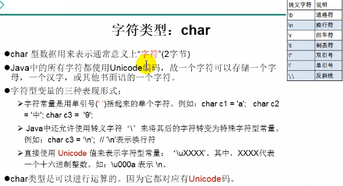

   boolean 类型

   

   #### 基本数据类型之间的运算规则

   前提：只讨论七种基本数据类型变量间的运算。不包含boolean类型的。

   1. 自动类型提升是
      - 结论： 当容量小的数据类型的变量与容量大的数据类型的变量做运算时，结果自动提升为容量大的数据类型
      - byte、char、short->int->long->float->double
      - 特别的：当byte、char、short三种数据变量做运算时，结果为int型
   2. 强制类型转换
      - 自动类型提升运算的**逆运算**
      - 需要使用强制转符：（）
      - 注意点：强制类型转换，可能导致精度损失

   说明：此时的容量大小指的是，表述数的范围的大和小。比如：float容量要大于long的容量

    

2. 引用数据类型

   1. String类型变量的使用
      - 声明String类型变量时，使用一对“”
      - String可以和8中基本类型变量做运算，且只能是连接运算：+
      - 运算的结果仍然是String类型
   2. 

3. 123

## 数组

 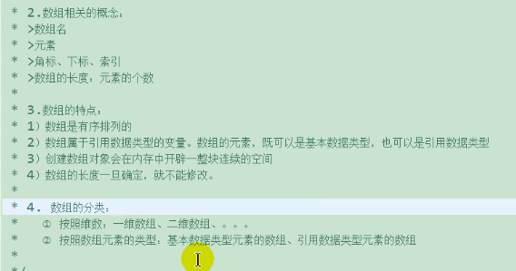

