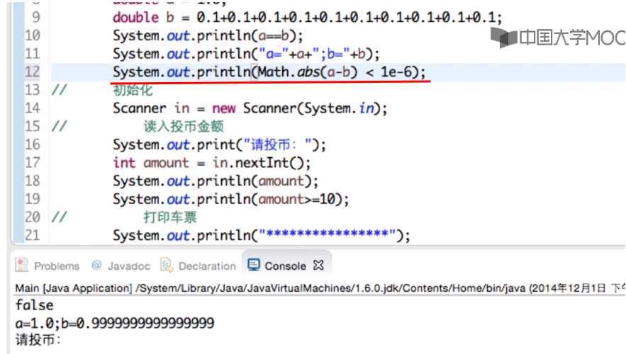
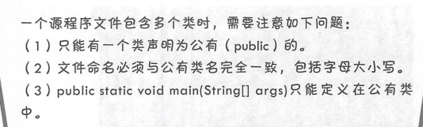
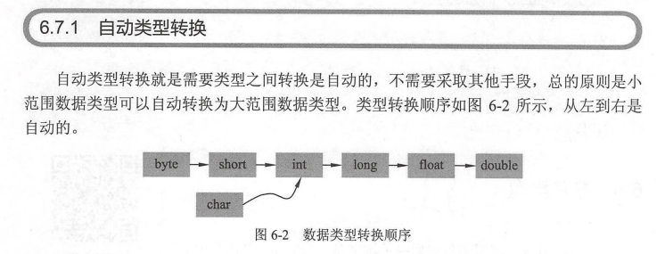
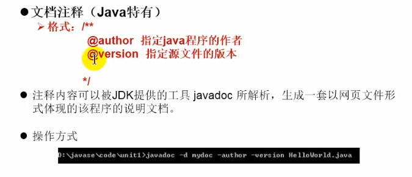

- 判断两个浮点数是否相等










## 运算符

·引 用号（．）。对象调用实例变量或实例方法 操作符，也 类调用静态变量或静态方法 操作符。 

 instanceof。判断某个对象是否属于某个类。 

•new 。对象内存分配运算符。 

箭头（ ＞）。 Java 8新增加的，用来声明 Lambda 表达式。 

·双冒号（：：〉 Java 8新增加的，用于 Lambda 表达式中方法的引用

- switch 语句中“表达式”计算结果只能是 int byte short char 类型，不能是 long, 更不能是其他的类型。每 cas 后面只能跟一个 int byte short char 类型的常量 default 语句可以省略。

## 增强for循环

```java
int[] numbers= { 43 , 32, 53 , 54 , 75, 7, 10 };
System out println ”一一增强 for ----");
／／增强 for 语句
for (int item : numbers) {
System.out.println(”Count i s :”+ item);
}
```

## 跳转语句

```java
continue ／／不带标签
continue label ／／带标签 abel 是标签名
```


## 字符串

Java SE 提供了三个字符串类：String、StringBuffer 和 StringBuilder。String 是不可变字符串，StringBuffer和StringBuilder是可变字符串。


## StringBuilder and StringBuffer


## 封装性与访问控制


## *静态变量、静态方法、静态代码块


## 抽象类（修饰词abstract）

## 比抽象类更加抽象的是接口，在接口中所有的方法都是抽象的。接口可以有成员变量

## Note：接口与抽象类一样都不能被实例化。

- 多继承


## 内部类


## 局部内部类


### 匿名内部类


