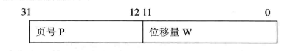
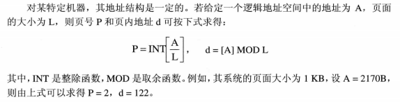
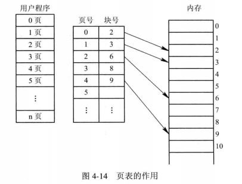
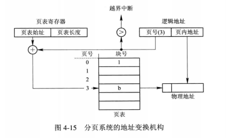
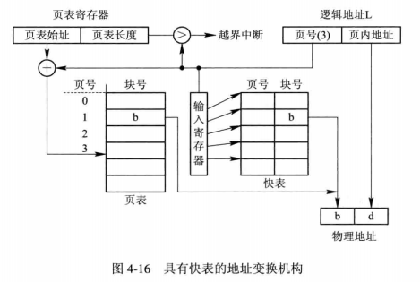
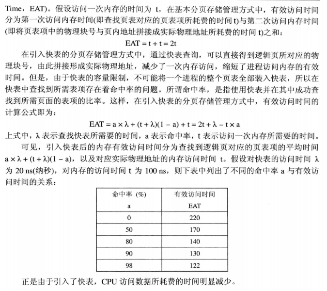
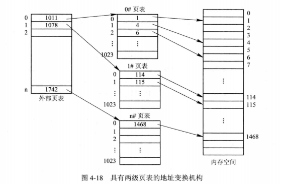

# 存储器管理

主要管理对象是内存

## 存储器的层次结构

现在计算机无一例外地采用了**多层结构的存储器系统**。

1. 多层结构的存储器系统
   1. 存储器的多层结构
   2. 可执行存储器
2. 主存储器与寄存器
   1. 主存储器
   2. 寄存器
3. 高速缓存和磁盘缓存
   1. 高速缓存（cache）
   2. 磁盘缓存（在内存中开辟一段空间作为缓存，是逻辑意义上的）

## 程序的装入和链接

程序在系统中运行，必须先装入内存，然后在将其转换成可执行程序

1. 程序的装入
   1. 绝对装入方式（Absolute Loading Mode）：编写代码时确定地址
   2. 可重定位装入方式（Relocation Loading Mode)：程序装入时确定地址
   3. 动态运行时的装入方式（Dynamic Run-time Loading)：程序运行时确定地址
2. 程序的链接
   1. 静态链接（Static Linking）
   2. 装入时静态链接（Load-time Dynamic Linking)
      1. 便于修改和更新
      2. 便于实现对目标模块的共享
   3. 运行时动态链接

## 连续分配存储管理方式

最早出现的一种内存分配方式，曾被广泛的应用于上世纪60-80年代的OS中

1. 单一连续分配
2. 固定分区分配：将整个用户空间划分为若干个固定大小的区域，在每个分区中只装入一道作业
   1. 划分分区的方法
      1. 分区大小相等
      2. 分区大小不相等
   2. 内存分配
3. 动态分区分配
   1. 数据结构
      1. 空闲分区表
      2. 空闲分区链
   2. 分配算法
   3. 分区分配操作
      1. 分配内存
      2. 回收内存
4. 基于顺序搜索的动态分区分配算法
   1. 首次适应算法（first fit ，FF）
   2. 循环首次适应算法（next fit，NF)
   3. 最佳适应算法（best fit，BF）
   4. 最坏适应算法（worst fit，WF）
5. 基于索引搜索的动态分区分配算法
   1. 快速适应算法（quick fit）
   2. 伙伴系统（buddy system）
   3. 哈希算法
6. 动态可重定位分区分配
   1. 紧凑
   2. 动态重定位分区
   3. 动态重定位分区分配算法

## 对换（Swapping)

1. 多道程序环境下的对换技术

   1. 对换的引入

      对换是指

   2. 对换的类型

      1. 整体对换：处理机中级调度
      2. 页面（分段）对换

2. 对换空间的管理

   1. 目标
      1. 文件区管理目标：离散分配方式
      2. 对对换空间管理的主要目标：连续分配方式
   2. 数据结构
   3. 分配与回收

3. 进程的换出与换入

   1. 换出
      1. 选择被换出的进程
      2. 进程换出的过程
   2. 换入

## 分页存储的管理方式

> 在该方式中，将用户程序的地址空间分为若干个固定大小的区域，称为页或页框（frame），页和块的大小相同。

1. 基本方法
   - 页面和物理块号
     - 页面
     - 页面大小
     
   - 地址结构
     - 
     - 
     
   - 页表
   
     - > 在分页系统中，允许将进程的各个页离散地存储在任意的物理块中，为保证进程仍然能正确运行，即能在内存中找到每个页面所对应的物理块，系统又为每个进程建立了一张页面映像表，简称页表。
   
     - 
   
2. 地址变换机构

   > 地址变换机构是为了实现逻辑地址转换为内存空间的物理地址。

   - 基本的地址变换机构
     - 
     - 具有块表的地址变换机构
       - 

3. 访问内存的有效时间

   - > 从进程发出指定逻辑地址的访问请求，经过地址变换，到在内存中找到对应的实际物理地址单元并取出数据，所需要花费的总时间，称为内存的有效访问时间（Effective Access Time，EAT）

   - 

4. 两级和多级页表

   - 两级页表

   - 
   - 多级页表

5. 反置页表

   - 反置业表的引入

     - > 为了减少页表占用的内存空间，引入了反置页表。
       >
       > 一般页表的页表项是按页号进行排序的，页表项中的内容是物理块号。
       >
       > 而反置页表则是为每一个物理块设置一个页表项，并将它们按物理块的编号排序。

   - 地址变换

## 分段存储管理方式

1. 

