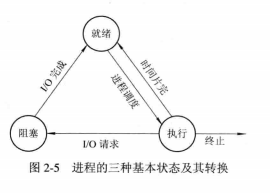
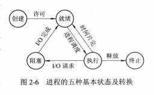
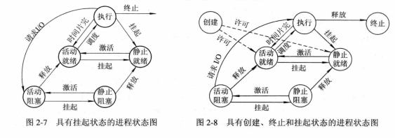
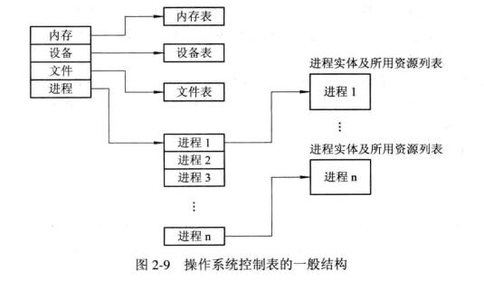
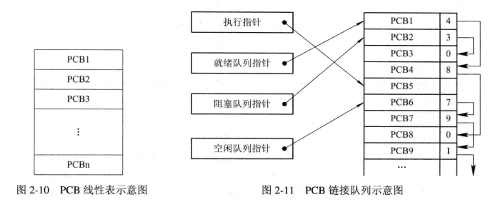
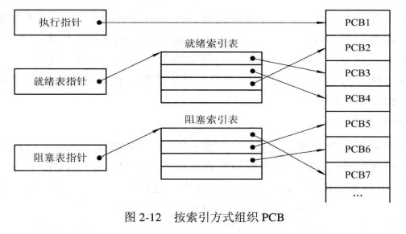

# 进程的描述与控制

> 进程是资源分配和独立运行的基本单位。
>
> 操作系统所具有的四大特征（并发、共享、虚拟、异步）也都是基于进程所实现的。

## 前驱图和程序的执行

1. 前驱图

2. 程序的顺序执行

   - 顺序执行是什么？
     - 一个应用程序由若干个**程序段**组成，每一个程序段完成特定的功能，它们在执行时，都需要按照某种先后次序顺序执行，仅当前一程序段执行完后，才运行后一程序段。
   - 特征是什么？
     - 顺序性
     - 封闭性
     - 可在线性

3. 程序的并发执行

   > Note:只有在不存在前趋关系的程序之间才有可能并发执行。

   - 并发执行
   - 特征是什么？
     - 间断性
     - 失去封闭性
     - 不可再现性

## 进程的描述

- 进程的定义和特征

  > 为了使参与并发的执行的每个程序（含数据）都能独立运行，在操作系统中必须为之配置一个专门的数据结构，称之为进程控制块（Process Control Block，PCB）。系统利用PCB来描述进程的基本情况和活动过程，进而控制和管理进程。这样，由程序段、相关数据段和PCB三部分便构成了进程实体（又称进程映像）。一般情况下，我们把进程实体称为进程。
  >
  > 例如：所谓创建进程，实质上是创建进程实体中的PCB；而撤销进程，实质上是撤消进程的PCB。

  - 定义：
    1. 进程是程序的一次执行。
    2. 进程是一个程序及其数据在处理机顺序执行时所发生的活动。
    3. 进程是具有独立功能的程序在一个数据集合上运行的过程，它是系统进行资源分配和调度的一个独立单位。
  - 特征：
    1. 动态性
    2. 并发性
    3. 独立性
    4. 异步性

- 进程的基本状态及转换

  - 进程的三种基本状态

    1. 就绪（Ready）
    2. 执行（Running）
    3. 阻塞（Block）

  - 三种基本状态的转换

    

  - 创建状态和终止状态

    - 创建状态
    - 终止状态
    - 

- 挂起操作和进程状态的转换

  - 挂起操作的引入
  - 引入挂起原语操作后三个进程状态的转换
  - 

- 进程管理中的数据结构

  - 操作系统中用于管理控制的数据结构

    

  - 进程控制块PCB的作用

    > PCB 的作用是使一个在多道程序环境下不能独立运行的程序（含数据）成为一个能独立运行的基本单位，一个能与其他进程并发执行的进程。

    1. 作为独立运行基本单位的标志
    2. 能实现间断性运行方式
    3. 提供进程管理所需要的信息
    4. 提供进程调度所需要的信息
    5. 实现与其它进程的同步与通信

  - 进程控制块中的信息

    1. 进程标识符
    2. 处理机状态
    3. 进程调度信息
    4. 进程控制信息

  - 进程控制块的组织方式

    - 线性方式

    - 链接方式

      

    - 索引方式

      

    

## 进程控制

> 进程控制是进程管理中最基本的功能，主要包括创建进程、终止已完成的进程、将因发生异常情况而无法继续运行的进程置于阻塞状态、负责进程运行中的状态装换等功能。
>
> 进程控制一般是由OS的内核中的原语实现的。

1. 操作系统的内核
2. 进程的创建
3. 进程的终止
4. 进程的阻塞与唤醒
5. 进程的挂起与激活

## 进程同步

> 为保证多个进程能有条不紊的运行，在多道程序系统中，必须引入进程同步机制

1. 进程同步的基本概念
2. 

## 经典进程同步问题

## 进程通信

## 线程（Thread）的基本概念

## 管程的实现

