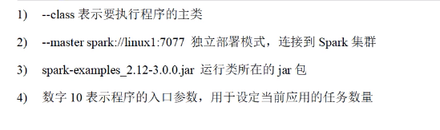

# 独立集群部署

## 1.解压文件

## 2.修改配置文件

- workers
- spark-env.sh

## 3.分发给集群

## 4. 启动spark集群

## 5. 测试

- 提交应用测试

```shell
 ./bin/spark-submit \
 --class org.apache.spark.examples.SparkPi \
 --master spark://master:7077 \
 ./examples/jars/spark-examples_2.12-3.1.2.jar 10
```



## 配置历史服务器

1. 修改spark-defaulta.conf 文件

   - spark.eventLog.enabled		true
   - spark.eventLog.dir		          hdfs://master:8020/directory
     - NOTE:需要启动集群，HDFS上的directory目录需要提前存在
   - sbin/start-dfs.sh
   - hadoop fs -mkdir /directory

2. 修改spark-env.sh文件，添加日志配置

   - export SPARK_HISTORY_OPTS=‘’
   - -Dspark.history.ui.port=18080
   - -Dspark.history.fs.logDirectory=hdfs://master:8020/directory
   - -Dspark.history.retainedApplications=30''
   - 

3. 分发配置文件

4. 重新启动集群和历史服务

5. 重新执行任务

   [Exception in thread "main" java.net.ConnectException: Call From master/172.21.3.210 to master:8020 failed on connection exception: java.net.ConnectException: 拒绝连接; For more details see:  http://wiki.apache.org/hadoop/ConnectionRefused]()

## 配置高可用（HA）（冗余）

> 通过Zookeeper配置

## yarn 模式


## k8s & Mesos 模式


