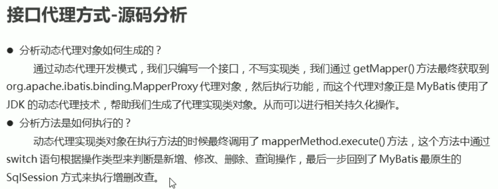

# MyBatis

> MyBatis 是一个优秀的基于java的持久层框架

## MyBatis 入门

1. 对象关系映射ORM

2.

## MyBatis 相关API

- Resources

  

- SQLSessionFactoryBuilder

  

- SqlSessionFactory

  

- SqlSession

  

- 小结

  

## 映射配置文件

- 映射配置文件介绍

  映射配置文件包含了数据和对象之间的映射关系以及要执行的SQL语句

  

- 查询功能

  

- 新增功能

  

- 修改功能

  

- 删除功能

  

- 小结

  

## 核心配置文件

- 核心配置文件介绍

  核心配置文件包含了Mybatis最核心的设置和属性信息，如数据库的连接，事务，连接池信息等。

  

- 数据库连接配置文件的引入

  

- 起别名

  

  

- 小结

  

## MyBatis 传统方式实现Dao

- 执行流程

  

  

## 接口代理的方式实现Dao层

## 映射配置文件-动态sql

## 核心配置文件-分页插件

## 多表操作

  

 

## 注解开发

## 注解多表操作

## 构建SQL语句

