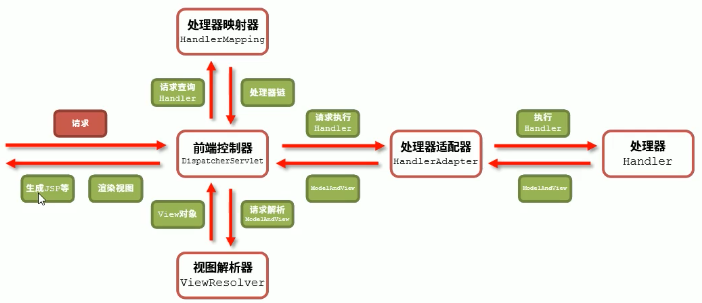
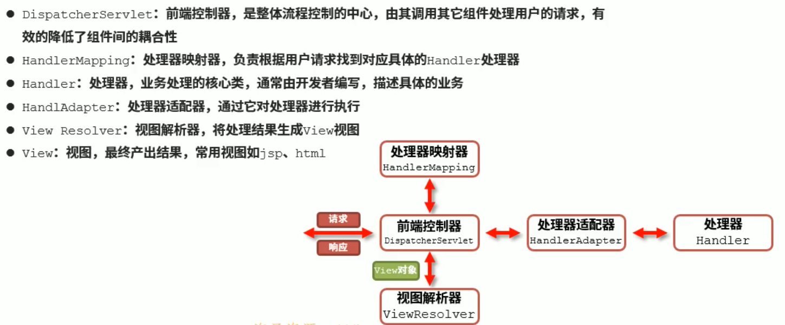
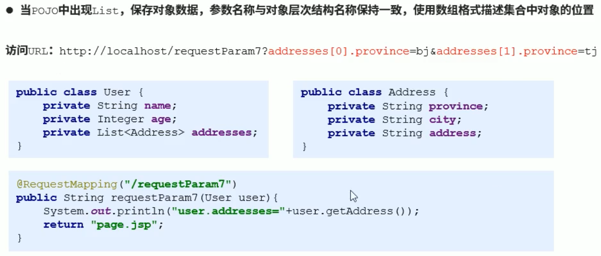
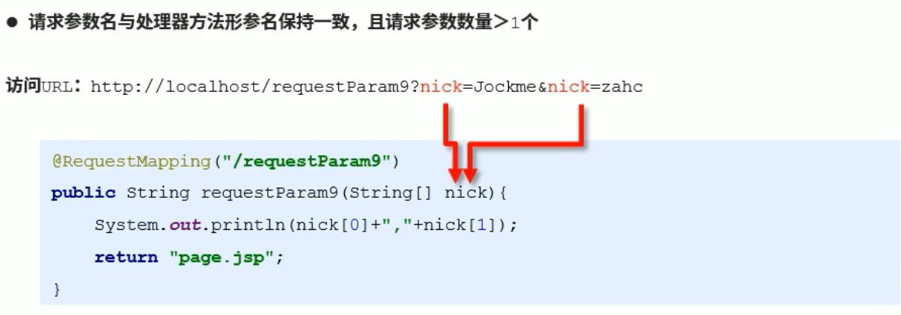
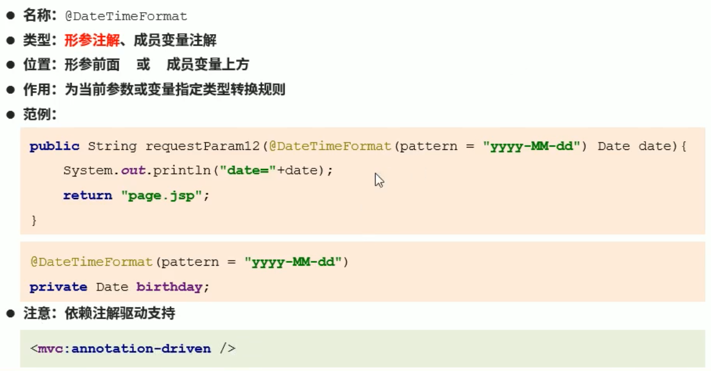
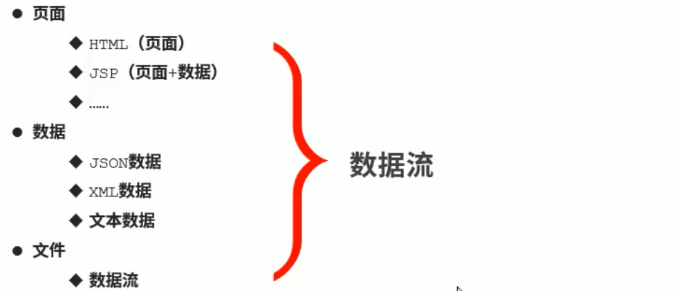
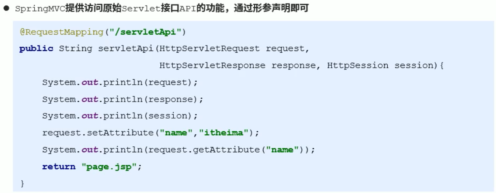
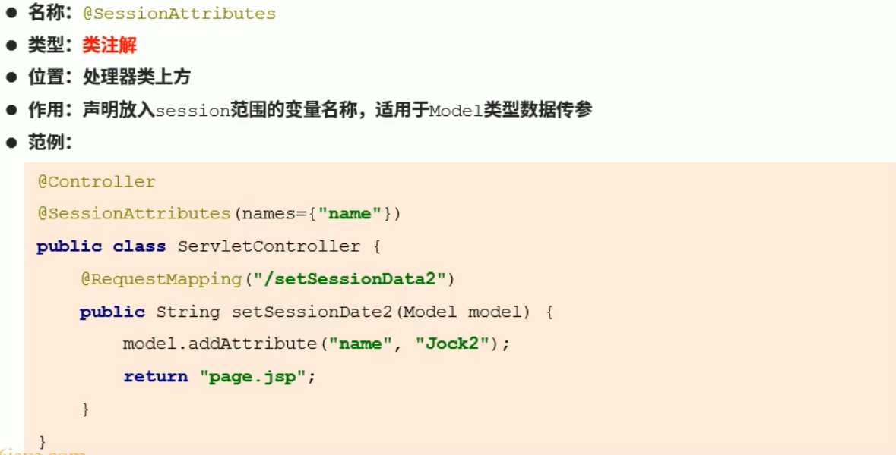

# SpringMVC

## 1.概述

### 三层架构

### MVC

- V即View视图是指用户看到并与之交互的界面。比如由html元素组成的网页界面，或者软件的客户端界面。MVC的**好处之一在于它能为应用程序处理很多不同的视图。在视图中其实没有真正的处理发生，它只是作为一种输出数据并允许用户操作的方式。**

- M即model模型是指模型表示业务规则。在MVC的三个部件中，模型拥有最多的处理任务。**被模型返回的数据是中立的，模型与数据格式无关，这样一个模型能为多个视图提供数据，由于应用于模型的代码只需写一次就可以被多个视图重用，所以减少了代码的重复性。**

- C即controller控制器是指**控制器接受用户的输入并调用模型和视图去完成用户的需求，控制器本身不输出任何东西和做任何处理。它只是接收请求并决定调用哪个模型构件去处理请求，然后再确定用哪个视图来显示返回的数据**。

### Spring MVC 简介

- Spring MVC是一种基于Java 实现MVC模型的轻量级Web框架
- 优点
  - 使用简单
  - 性能突出
  - 灵活性强

## 2. 入门案例

### 入门案例制作

### 工作流程分析

### 技术架构图

- 
- 

## 3. 基本配置-常规配置

### Controller加载控制

#### bean加载控制说明

### 静态资源加载

### 中文乱码处理

### 注解驱动

## 4. 请求

### 请求参数(重点)

#### 请求参数类型

#####  普通类型参数

##### POJO类型参数

- 

- 参数冲突
- 复杂POJO类型参数
  - 
  - 
  - 
  - 

##### 数组类型参数

##### 集合类型参数

### 类型转换

- 日期类型格式化转换器
  - 
  - 

### 请求映射(重点)

## 5. 响应

### 响应方式

### 无数据跳转页面

#### 页面跳转设定

#### 页面跳转方式

#### 页面访问快捷配置

### 带数据跳转页面(重点)

### 纯数据返回(JSON)(重点)

## 完全注解开发 

## Servlet相关接口-Servlet相关接口的替代方案

### HttpServletRequest AND ServletResponse AND HttpSession

### Head数据获取

### Cookie数据获取

### Session数据获取

- Session数据设置

