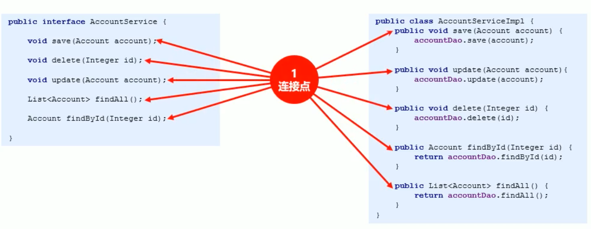
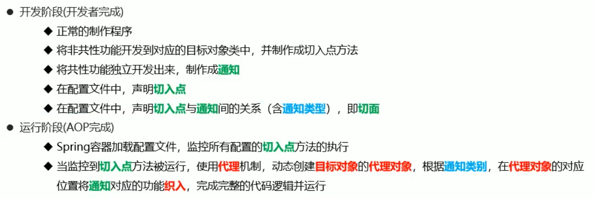
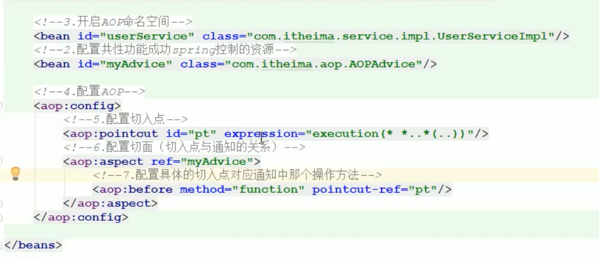
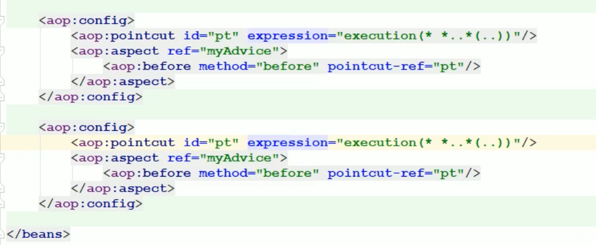
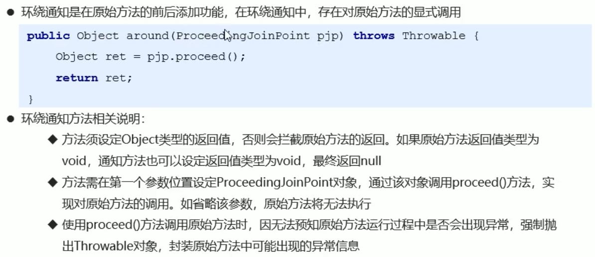
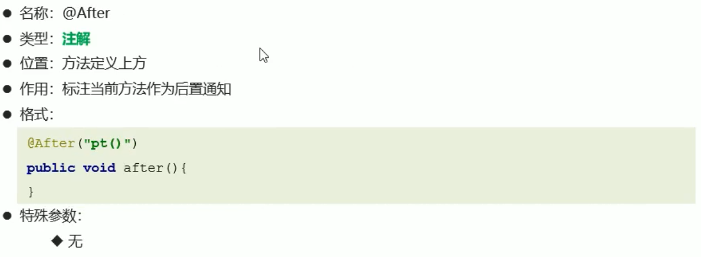

# Spring

## Spring简介

### 什么是框架


### 框架有什么用

- 提高开发效率
- 增强可重用性
- 提供编写规范
- 节约维护成本
- 解耦底层实现原理

### Spring是什么


### Spring的体系结构


### Spring发展历程


### Spring的优势


## IOC简介

### 耦合与内聚

- 

### IOC的出现---工厂模式衍化而来

  - 
  - 
  - 
  - 
###  IOC的概念
  - 

## 入门案例

### 制作步骤


TODO

```java
```


## IOC配置(xml)

### Bean

- 

- 
- 
- bean对象的创建方式
  - 静态工厂bean
    - 
  - 实例工厂bean
    - 

### DI

#### 简介

- 

#### IOC与DI的关系

  - 是同一件事站在不同角度看待的问题

#### set方法注入(主流)

  - 

#### 构造器注入(了解)

  - 
  - 

#### 集合数据类型注入

- 
- list
  - 
- props
  - 
- array
  - 
- set
  - 
- map
  - 

#### 使用p命名空间简化配置(了解)


#### spring EL(SpEL)表达式

- 
- 
- 

### properties文件


### 团队开发

- import 导入配置文件
- 
- 

### ApplicationContext

- 
- 

### 第三放资源配置


## 综合案例

#### Spring整合Mybatis

- 
- 基础准备工作
  - 
- 整合准备工作
  - 

- 整合工作
  - 

## 注解开发

### 注解驱动的意义

- 什么是注解驱动

  - 

- 注解驱动的弊端

  - 

  

### 常用注解(重点)

- 启动注解功能

  - 

- bean注解定义

  - 

- bean作用域

  - 

- bean生命周期

  - 

#### 加载第三方资源
  - 

#### bean的非引用类型属性注入

- 

#### bean的引用类型属性注入

- 
- 
- 

#### 加载properties文件

- 

#### 纯注解开发

-  

#### 第三方bean配置与管理
  - 

### bean加载控制

- 依赖加载
  - 
  - 
  - 
- 依赖加载应用场景
  -  

### 整合第三方技术(重点)

#### 注解整合MyBatis


##### 注解整合MyBatis分析


##### 注解整合MyBatis步骤


#### 注解整合Junit


### IOC底层核心原理

#### IOC核心接口


#### bean加载过程解析


#### bean初始化过程解析


## AOP

### AOP简介

- AOP概念
  - 
- AOP作用
  - 
- AOP优势
  - 提高代码的可重用性
  - 业务代码编码更简洁
  - 业务代码维护更高效
  - 业务功能扩展更便捷

### 入门案例

- **AOP的核心概念**
  - 
  - 
  - 
  - 
  - 
  - 
  - 
  - 
- AOP的工作流程分析
  - 
- 案例
  - 
  - 
  - 

### AOP配置（XML）

#### 切入点

- AspectJ
  - 
- AOP配置
  - 
  - 
  - 
  - 
- 切入点
  - 切入点描述的是某个方法
  - 切入点表达式是一个快速匹配方法描述的通配格式，类似于正则表达式
  - 
  - **切入点表达式-关键字**
  - 
  - **切入点表达-通配符**
  - 
  - **切入点表达式-逻辑表达式**
  - 
  - **切入点表达式-范例**
  - 
  - 切入点的三种配置方式
  - 
  - 切入点配置经验
  - 
  - 

#### 通知

- 通知类型
  - 
- 前置通知
  - 
- 后置通知
  - 
- 返回后通知
  - 
- 抛出异常后通知
  - 
- 环绕通知
  - 
- 环绕通知的开发方式
  - 
- 通知顺序(了解)
  - 当同一个切入点配置了多个通知时,通知存在运行的先后顺序,顺序以通知配置的顺序为准
- 通知获取参数
  - 参数
    - 通知获取参数数据
      - 
      - 
      - 
  - 返回值
    - 

  - 异常
    -  
    - 

### AOP配置（注解）

- 

- 

- 

- 

- 

- 

-  

- 

- 注解开发AOP注意事项

  - 

- 注解AOP通知执行顺序(了解)

  - 

- 纯注解开发

  - 

    

### 综合案例


### AOP底层原理

#### 装饰者模式


#### JDKProxy动态代理


#### Cglib代理


#### 织入时机


## 事务管理

- 事务是数据操作最基本单元,逻辑上一组操作,要么都成功,如果有一个失败所有的操作都失败
- 事物的四个特性(ACID)
  -  原子性
  - 一致性
  - 隔离性
  - 持久性
