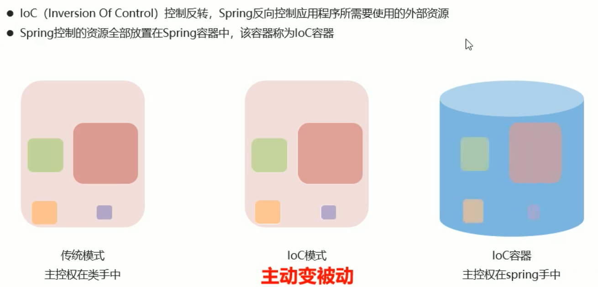

# Spring

## Spring简介

### 什么是框架


### 框架有什么用

- 提高开发效率
- 增强可重用性
- 提供编写规范
- 节约维护成本
- 解耦底层实现原理

### Spring是什么


### Spring的体系结构


### Spring发展历程


### Spring的优势


## IOC简介

### 耦合与内聚

- 

### IOC的出现---工厂模式衍化而来
  - 
  - 
  - 
  - 
###  IOC的概念
  - 

## 入门案例

### 制作步骤


TODO

```java
```


## IOC配置(xml)

### Bean

- 

- 
- 
- bean对象的创建方式
  - 静态工厂bean
    - 
  - 实例工厂bean
    - 

### DI

#### 简介

- 

#### IOC与DI的关系

  - 是同一件事站在不同角度看待的问题

#### set方法注入(主流)

  - 

#### 构造器注入(了解)

  - 
  - 

#### 集合数据类型注入

- 
- list
  - 
- props
  - 
- array
  - 
- set
  - 
- map
  - 

#### 使用p命名空间简化配置(了解)


#### spring EL(SpEL)表达式

- 
- 
- 

### properties文件


### 团队开发

- import 导入配置文件
- 
- 

### ApplicationContext

- 
- 

### 第三放资源配置


## 综合案例

#### Spring整合Mybatis

- 
- 基础准备工作
  - 
- 整合准备工作
  - 

- 整合工作
  - 

## 注解开发

### 注解驱动的意义

- 什么是注解驱动

  - 

- 注解驱动的弊端

  - 

  

### 常用注解(重点)

- 启动注解功能

  - 

- bean注解定义

  - 

- bean作用域

  - 

- bean生命周期

  - 

#### 加载第三方资源
  - 

#### bean的非引用类型属性注入

- 

#### bean的引用类型属性注入

- 
- 
- 

#### 加载properties文件

- 

#### 纯注解开发

-  

#### 第三方bean配置与管理
  - 

### bean加载控制

- 依赖加载
  - 
  - 
  - 
- 依赖加载应用场景
  -  

### 整合第三方技术(重点)

#### 注解整合MyBatis


##### 注解整合MyBatis分析


##### 注解整合MyBatis步骤


#### 注解整合Junit

### IOC底层核心原理

