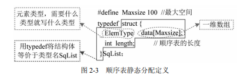
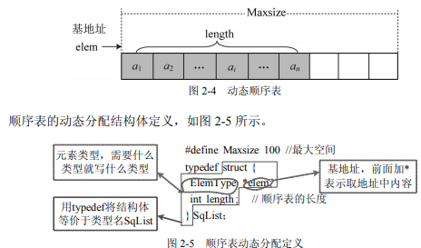
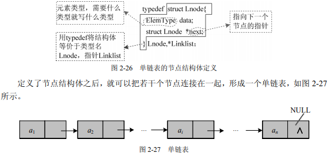
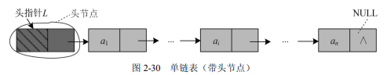
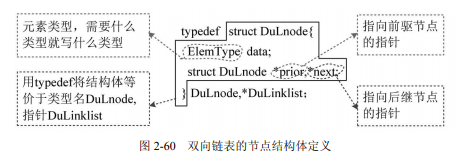

# 线性表

> 线性表是由N（n>0）个相同类型的数据元素组成的有限序列，它是最基本的、最常用的一种线性结构。
>
> 线性表有唯一的开始和结束， 除了第一个元素外，每个元素都有唯一的直接前驱：除了最后一个元素外，每个元素都有唯 一的直接后继。
>
> 线性表有两种存储方式：顺序存储和链式存储。采用**顺序存储**的线性表称为**顺序表**，采 用**链式存储**的线性表称为**链表**。链表又分为单链表、双向链表和循环链表。

## 顺序表

> 顺序表采用**顺序存储方式**，即逻辑上相邻的两个数据在计算机内的存储位置也是相邻的。

1. 静态分配

   

2. 动态分配

> 采用动态存储方法，在运算过程中，如果发生溢出，可以另外开辟一块更 大的存储空间，用以替换原来的存储空间，从而达到扩充存储空间的目的。

3. 顺序表的基本操作

   - 初始化

     > 初始化是指为顺序表分配一段预定义大小的连续空间，用 elem 记录这段空间的基地址， 当前空间内没有任何数据元素，因此元素的实际个数为 0。假设我们已经预定义了一个最大空间数 Maxsize，那么就用 new 分配大小为 Maxsize 的空间，分配成功会返回空间的首地址， 分配失败会返回空指针。

   - 创建

     > 顺序表创建是向顺序表中输入数据，输入数据的类型必须与类型定义中的类型一致。

   - 取值

     > 顺序表中的任何一个元素都可以立即找到，称为随机存取方式。

   - **查找**

   - 插入

     > 在顺序表中第 i 个位置之前插入一个元素 e，需要从最后一个元素开始，后移一位…… 直到把第 i 个元素也后移一位，然后把 e 放入第 i 个位置。

   - 删除

     > 在顺序表中删除第 i 个元素，需要把该元素暂存到变量 e 中，然后从 i+1 个元素开始前 移……直到把第 n 个元素也前移一位，即可完成删除操作。

顺序表的**优点**：操作简单，存储密度高，可以随机存取，只需要 O(1)的时间就可以取出 第 i 个元素。

 顺序表的**缺点**：需要预先分配最大空间，最大空间数估计过大或过小会造成空间浪费或 溢出。插入和删除操作需要移动大量元素。

 在实际问题中，如果经常需要插入和删除操作，则顺序表的效率很低。**为了克服该缺点， 可以采用链式存储。**

## 单链表

> 每个节点包含两个域：数据域和指针域。数据域存储数据元素， 指针域存储下一个节点的地址，因此指针指向的类型也是节点类型。每个指针都指向下一个 节点，都是朝一个方向的，这样的链表称为单向链表或单链表。

1. 存储方式

   

   ​	有时为了操作方便，还会给链表增加一个不存放数据的头节点（也可以存放表长等信 息），

> 在单链表中，想找第 i 个元素就没那么容易，必须从头开始，按顺序一个 一个找，一直数到第 i 个元素，称为**顺序存取**。

2. 基本操作

   - 初始化

   - 创建

     - > 创建单链表分为头插法和尾插法两种，头插法是指每次把新节点插到头节点之后，其创 建的单链表和数据输入顺序正好相反，因此也称为逆序建表。
       >
       > 尾插法是指每次把新节点链接到链表的尾部，其创建的单链表和数据输入顺序一致，因此也称为正序建表。

   - 取值：只能顺序查找

   - 查找

   - 插入

   - 删除

## 双向链表

1. 存储方式

   

2. 基本操作

   - 初始化：双向链表初始化是指构建一个空表。先创建一个头 节点，不存储数据，然后令其前后两个指针域均为空
   - 创建：创建双向链表也可以用头插法和尾插法。头插法创建的链表和输入顺序正好相反，称为 逆序建表；尾插法创建的链表和输入顺序一致，称为正序建表。
   - 取值
   - 查找
   - 插入
   - 删除

## 循环链表

> 单链表中，只能向后，不能向前。如果从当前节点开始，无法访问该节点前面的节点， 而最后一个节点的指针指向头节点，形成一个环，就可以从任何一个节点出发，访问所有的 节点，这就是循环链表。
>
> 循环链表和普通链表的区别就是最后一个节点的后继指向了头节点。

**链表的优点**：链表是动态存储，不需要预先分配最大空间； 插入删除不需要移动元素。

**链表的缺点**：每次动态分配一个节点，每个节点的地址是 不连续的，需要有指针域记录下一个节点的地址，指针域需要 占用一个 int 的空间，因此存储密度低（数据所占空间/节点所占总空间）。存取元素必须从头到尾按顺序查找，属于顺序存取。

## 线性表的应用

1. 合并有序顺序表
2. 合并有序链表
3. 就地逆置单链表
4. 查找链表的中间节点
5. 删除链表中的重复元素

